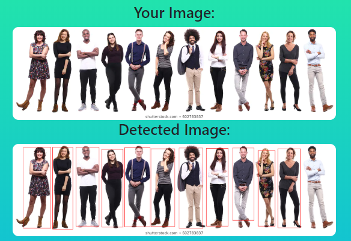
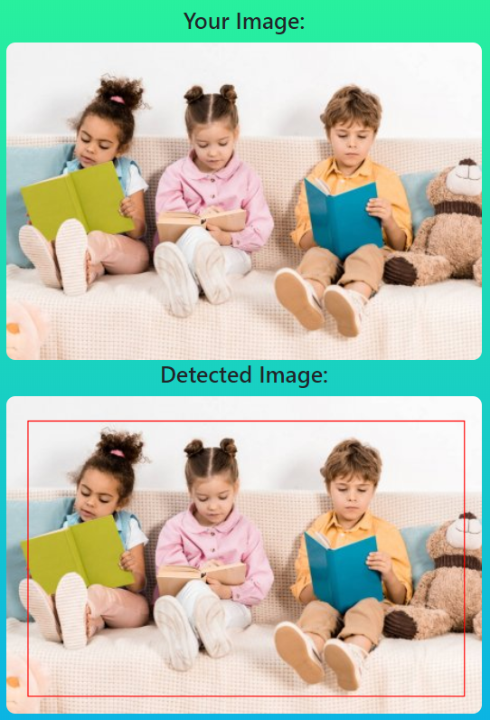
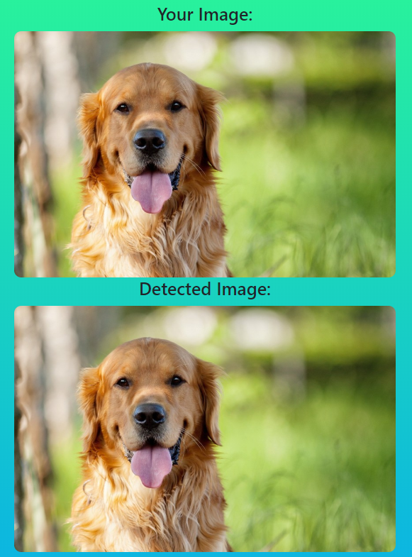

# Object detection

*руководитель проекта: Илья Захаркин (Сколтех, ФИВТ МФТИ) | @ilyazakharkin*

### Запуск детектора

Установка зависимостей

```
cd detection-dlschool
pip install -r requirements.txt
```

Запуск сервера

```
python -m flask run
```

или

```
python app.py
```

### Выбор фреймворка/библиотеки для использования детектора

Я выбрала `torchvision.models.detection.fasterrcnn_resnet50_fpn`.

### Выбор фреймворка/библиотеки для разработки веб/мобильного демо и его оформление

`Flask, Flask-Bootstrap`

### Запуск модели/сервера и тестирование демо

Первоначально сервер был сделан по [туториалу 1](https://pytorch.org/tutorials/intermediate/flask_rest_api_tutorial.html) и [туториалу 2](https://github.com/avinassh/pytorch-flask-api-heroku).

При деплое возникли некоторые проблемы. Модель оказалась требовательна к ресурсам и во время предсказания могла занимать около 1.5Гб оперативной памяти. На локальной машине она работает нормально, но Heroku крашился во время предсказания из-за нехватки RAM, поэтому пришлось воспользоваться Google Cloud с большей вычислительной мощностью.
 
Демо работает хорошо только со стоковыми изображениями (то есть с белым фоном и без размытий). На обычных фотографиях не предсказываются боксы (очень маленький скор, около 0.1).

*Например:*

+ неплохо;



+ пойдёт;



+ вообще ничего.



### TODO:

+ [ ] Попробовать другие модели детекции (YOLOv3, detectron).

+ [ ] Сделать подписи к обнаруженным объектам.

+ [ ] Попробовать изменить метод сохранения предсказанного изображения (например, сохранять в файл).
