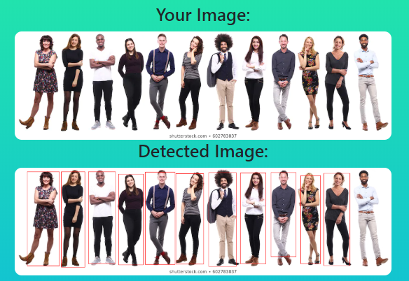
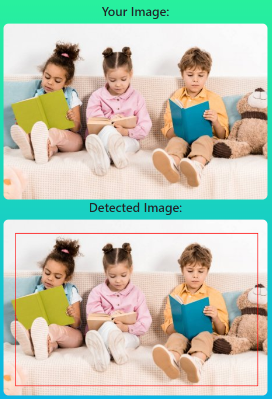
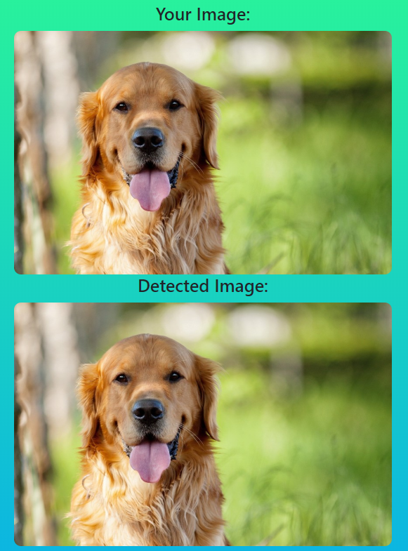

# Object detection

*руководитель проекта: Илья Захаркин (Сколтех, ФИВТ МФТИ) | @ilyazakharkin*

---

Работающее демо можно опробовать [здесь](https://detection-dlschool.herokuapp.com/).

---

**Выбор фреймворка/библиотеки для использования детектора**

Я выбрала `torchvision.models.detection.fasterrcnn_resnet50_fpn`.

**Выбор фреймворка/библиотеки для разработки веб/мобильного демо и его оформление**

`Flask, Flask-Bootstrap`

**Тестирование демо**

TLDR: Демо работает хорошо только со стоковыми изображениями (то есть с белым фоном и без размытий). На обычных фотографиях не предсказываются боксы (очень маленький скор, около 0.1).

*Например:*

+ Неплохо

+ Пойдёт

+ Вообще ничего

